# How Handy feels lightweight, smooth & instant — teardown synthesis

> Line-level teardown of **cjpais/Handy** (`_handy-src/`, HEAD `9b0d8a1`, 2026-07-01), the "most forkable" offline STT app.
> Same stack as Voicetypr: **Tauri 2.x + Rust + React 19/TS + Zustand**.
> The five deep-dives (`01`–`05`) are the evidence; this file is the answer and the roadmap.

---

## TL;DR — the one-sentence answer

Handy feels instant because **it does not make you wait for anything**: text appears *while you speak* (real streaming with a flicker-free committed/tentative split), the pill *never steals focus* (a real non-activating `NSPanel`), onboarding is *two screens gated on one real action*, and the whole backend is a *legible manager graph with a compile-checked IPC contract*. Your hunch was right — **streaming is the mechanism**, and it's backed by a lock-free audio path so an always-on mic costs ~nothing when idle.

---

## The "aha": streaming, verified end-to-end at code level

The pill in your screenshot ("Yo, CJ… Transcribing…") is the *visible* tip. The engine underneath streams partial decodes to the overlay as audio arrives. I traced the whole path independently (not inferred from the UI):

```mermaid
flowchart LR
  MIC["cpal RT thread<br/>mono mixdown"] -->|mpsc| CONS["consumer thread"]
  CONS --> RS["FrameResampler<br/>16kHz / 30ms / 480 samples"]
  RS --> VAD["SmoothedVad<br/>Silero, speech-only"]
  VAD -->|speech frame| FEED["StreamRouter::feed<br/>1 relaxed atomic load"]
  FEED -->|StreamCmd::Feed| WK["stream worker<br/>engine leased out of mutex"]
  WK -->|committed_changed / tentative_changed| EMIT["StreamTextEvent<br/>{committed, tentative}"]
  EMIT -->|tauri event| UI["RecordingOverlay.tsx<br/>two sibling spans"]
```



| Stage | Where | What makes it fast/smooth |
|---|---|---|
| Idle mic frame | `transcription.rs:145` | **one `Relaxed` atomic load** then return — always-on mic is nearly free |
| Speech gate | `recorder.rs:508-541` | Silero VAD forwards **only speech frames**; silence never reaches the worker |
| Frame → worker | `transcription.rs:88-151` | `Feed`+`Finalize`+`Cancel` on **one mpsc** → FIFO guarantees last frame decodes before finalize (no lost-tail bug class) |
| Decode | `transcription.rs:804-832` | engine is **leased out of the mutex** → ~33 decodes/s run lock-free; `is_model_loaded()` stays truthful via `active_engine_lease` |
| Emit gate | `transcription.rs:942` | emits **only when `committed_changed \|\| tentative_changed`** — no redundant events |
| Contract | `bindings.ts:985` | tauri-specta generated `StreamTextEvent = { committed, tentative }`, event `"stream-text-event"` |
| Render | `RecordingOverlay.tsx:238-241` | **two always-present sibling spans**, reconcile-by-position |

### The anti-flicker trick (the single biggest *perceptual* lever)

```tsx
// RecordingOverlay.tsx:237-241
<span className="committed">{streamText.committed ? streamText.committed + " " : ""}</span>
<span className="tentative">{streamText.tentative}</span>
```

- `committed` is an **append-only** prefix — the backend contract promises it never *backtracks* (already-shown words never rewrite or jump).
- `tentative` is the sole volatile tail the model may rewrite each chunk.
- They are two **sibling spans with no keys** → React reconciles by position, so a wholesale `tentative` rewrite **cannot relayout the committed glyphs**.
- There is *no* `.committed` CSS rule and `.tentative { color: inherit }` is a no-op (`RecordingOverlay.css:223`) — the two spans render identically. **Flicker-freedom is structural (DOM + backend monotonicity), not cosmetic.**

> Precision note: the committed text node *does* change when a word graduates tentative→committed; it just never *shrinks*. The guarantee lives implicitly in the streaming core — a fork should add a debug-assert that each emitted `committed` is a prefix of the next.

> Honest gap: the actual committed/tentative *split algorithm* lives in the published `transcribe-cpp` crate (v0.1.0, not vendored). The contract Handy observes is exact; the promotion rule (chunk size, lookahead) is `[INFERENCE]`. See `01-streaming-engine.md §5`.

---

## Why each dimension feels the way it does

### Lightweight (onboarding) — `03-onboarding.md`
- **Two screens, not a wizard.** `OnboardingStep = "accessibility" | "model" | "done"` (`App.tsx:22`) — permissions, then a model. No welcome/EULA/account/theme gauntlet. Hand-rolled state, no router.
- **Completion gated on the *meaningful* action.** `onboarding_completed=true` is set **only** inside `switch_active_model` (`models.rs:120`) **with rollback on load failure** (`:146-152`), and the backend **refuses to auto-select** until then (`model.rs:1386`). "Completed" therefore *means* "the user has a working transcription target."
- **Returning users skip everything**; revoked-perms users see only the accessibility step (`App.tsx:229,244`).
- **Downloads are non-blocking & phase-aware** — determinate bar + EWMA-smoothed MB/s + distinct verify/extract states (`ModelCard.tsx:285-344`); the step advances on **observed ready-state** (`is_downloaded && !downloading && !verifying && !extracting`), never a timer (`Onboarding.tsx:60-101`).
- **No dead-ends**: re-clickable grant buttons + 3-strike poll budget + App-level "proceed and fix in settings" fallback (`App.tsx:206-208`).

### Smooth (overlay) — `02-overlay-ux.md`
- **Never steals focus**: real non-activating `NSPanel` (`can_become_key_window:false`, `nonactivating_panel`, `no_activate`, `PanelLevel::Status`) — you dictate into your editor uninterrupted while the pill pops. Cancel still works via `accept_first_mouse(true)`.
- **Card morphs, never tears down**: `grid-template-rows: 0fr → 1fr` reveal (440ms), width/border-radius morph (460ms), one `key={session}` pop per recording — only *animatable* properties transition (no `height:auto`).
- **High-rate mic-level channel is cheap**: delivered via `emit_to("<label>")` (single `eval_script`/callback) gated by a cached atomic, **skipped entirely when overlay off** (`overlay.rs:456-478`) — fixes hidden-overlay accumulation (issue #1279). *(Note: the lower-rate stream text/phase events use broadcast `.emit()`, `transcription.rs:1083,1091` — the `emit_to` optimization is reserved for the ~24Hz level path.)*

### Instant (backend/models) — `04-backend-architecture.md`, `05-model-and-postprocessing.md`
- **Compile-checked IPC**: `collect_commands!`/`collect_events!` → debug-build `export("../src/bindings.ts")` (`lib.rs:530,642`). No `invoke("maybe-typo")`; renames are compile errors both ways.
- **Legible manager graph**: `initialize_core_logic` is ~30 lines constructing 4 `Arc` managers in dependency order, injected by constructor arg (`lib.rs:158-182`) — a fork reads the whole object graph in one screen.
- **Zero-network catalog**: `catalog.json` is `include_str!`-baked (`catalog/mod.rs:103`) — the model list is instant on first launch.
- **Resumable + SHA-256-verified downloads**, hashing in `spawn_blocking` (`model.rs:1899-1921`); **idle-unload watcher** frees GBs of GPU memory automatically (`transcription.rs:315-336`).
- **Deferred side effects**: Enigo/global-shortcuts are *not* initialized in `setup` — the frontend triggers them post-onboarding (`lib.rs:150-153`), so macOS permission prompts never ambush first launch.

---

## Voicetypr today vs Handy — the real delta

Verified against Voicetypr `main` (this repo), not assumed:

| Axis | Handy | Voicetypr today | Gap |
|---|---|---|---|
| **Live text** | streams `committed`/`tentative` while speaking | **batch only** — `RecordingState = Idle→Starting→Recording→Stopping→Transcribing→Idle`, no `Streaming` state, no partials | **the big one** — this *is* the "smooth/instant" the users praise |
| **IPC contract** | tauri-specta generated `bindings.ts` | **hand-written `invoke` strings**, no `bindings.ts`, no `specta` in `Cargo.toml` | typo-safety + refactor safety |
| **Onboarding** | ~250-line 2-step orchestrator, 1 bool gate | **1669-line `OnboardingDesktop.tsx` monolith** (has known hotkey-capture bugs) | maintainability + smoothness |
| **Lifecycle** | single-thread `mpsc` coordinator, 30ms debounce | `RecordingStateMachine` (233ln) is a **transition *validator*, not a serializing coordinator thread** | race elimination for hotkey/signal/paste |
| **Audio→engine seam** | `Arc<StreamRouter>`, 1 atomic load/idle-frame | batch: record→normalize(ffmpeg)→transcribe whole file | needed only if VT adds streaming |
| **Overlay focus** | real non-activating `NSPanel` | has pill (`RecordingPill.tsx`, `components/pill/`) — NSPanel status *(unverified here; VT AGENTS.md claims NSPanel)* | likely already close |
| **Model catalog** | `include_str!` `catalog.json` | whisper+parakeet managers, model tables | catalog-driven refactor optional |
| **Polish** | `llm_client.rs` + `StreamWorkKind::Polishing` | already has `ai/` + `cloud_stt/` | parity-ish |

---

## Recommended roadmap for Voicetypr (prioritized, concrete)

**P0 — the streaming vertical (what actually earns the "smooth/instant" reputation)**
1. Add a `Streaming` recording state + a `StreamTextEvent { committed, tentative }` event. Enforce **append-only committed** in the Rust core (debug-assert prefix invariant).
2. Render live text as **two sibling spans** in `RecordingPill`/`pill` (append-only committed + volatile tentative). ~3 lines of JSX; the value is the backend monotonicity guarantee.
3. Build the **audio→worker seam**: `Arc<StreamRouter>` with a `Relaxed` atomic `open` fast-path; **single mpsc** for `Feed`+`Finalize`+`Cancel` (FIFO); **lease the engine out of the mutex** during decode so per-frame work holds no global lock.
   - *Blocker to confirm first:* does VT's engine (whisper.cpp / Parakeet) expose an incremental/partial decode? If not, build the committed/tentative split at VT's adapter layer (commit a whisper segment only after N ms of following audio confirms it). This gates the whole P0. See `01-streaming-engine.md §5`.
4. Gate streaming on **Silero VAD with a long streaming hangover** (~1.65s) so the live text doesn't flap closed between words (`04 §7`).

**P1 — cheap, high-leverage wins independent of streaming**
5. **Adopt tauri-specta** — generate `src/bindings.ts`, kill hand-written `invoke` strings. Whole-codebase compile-time IPC safety. (`04 §2-3`.)
6. **Rewrite onboarding** to a ~2-step state machine gated on one persisted bool set at model-*activation* with rollback + no silent auto-select. Retire the 1669-line monolith. (`03 §H1-H5`.)
7. **Promote `RecordingStateMachine` to a single-thread coordinator** with an `mpsc` mailbox + 30ms press debounce, serializing hotkey/signal/paste. Eliminates the "press during paste" / overlapping-recording bug classes. (`01 §2.9`.)

**P2 — polish & robustness**
8. `emit_to("<pill-label>")` for any high-rate overlay channel (waveform/level), gated by a cached atomic, skipped when overlay off. (`02 High`.)
9. Catalog-driven models (`include_str!`), resumable+verified downloads, idle-unload watcher. (`05 High/Med`.)
10. If adding LLM polish egress: **explicit "sends transcripts to {provider}" warning** + default to on-device — Handy's generic toggle is a privacy footgun VT should *avoid*. (`05 Avoid`.)

---

## The deep-dives

| Doc | Subsystem | Lines | Crown-jewel finding |
|---|---|---|---|
| [`01-streaming-engine.md`](./01-streaming-engine.md) | streaming core + coordinator | 440 | single-mpsc FIFO + RAII worker guard + engine leasing |
| [`02-overlay-ux.md`](./02-overlay-ux.md) | pill/overlay UI + backend | 402 | two-span structural anti-flicker + non-activating NSPanel |
| [`03-onboarding.md`](./03-onboarding.md) | first-run flow | 515 | 2-step, gated on model activation, no dead-ends |
| [`04-backend-architecture.md`](./04-backend-architecture.md) | wiring + bindings + audio/VAD | 644 | specta contract + manager graph + recorder→router seam |
| [`05-model-and-postprocessing.md`](./05-model-and-postprocessing.md) | catalog/download + LLM polish | 548 | baked catalog + resumable/verified + lease-aware unload |

**Provenance:** Handy source at `_handy-src/` (depth-1 clone, HEAD `9b0d8a1`), read-only. Every claim in the deep-dives carries a `path:line` citation. Streaming flow independently re-verified in this synthesis. Inferences (notably the `transcribe-cpp` split algorithm) are marked `[INFERENCE]` at their source.
