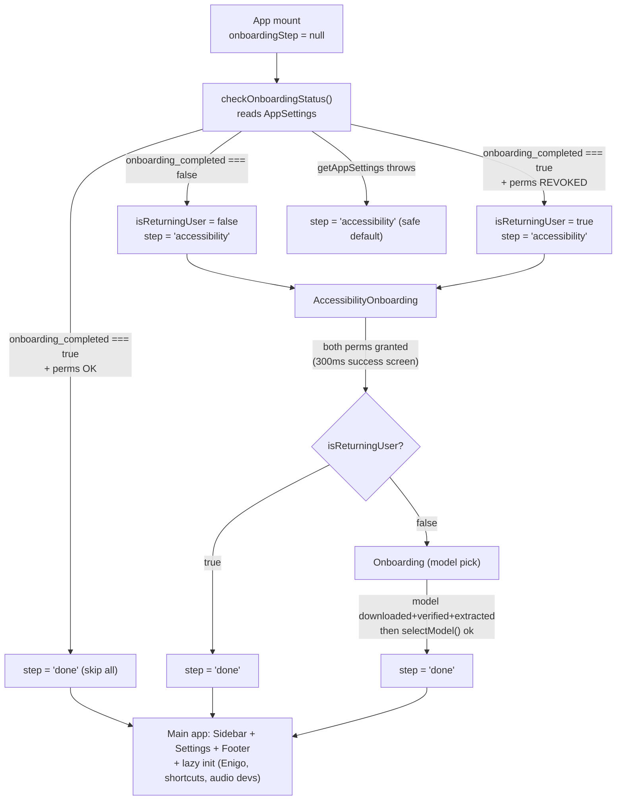

# Onboarding & First-Run Flow — Handy teardown

**TL;DR.** Handy's onboarding is a deliberately tiny **2-step** state machine (`accessibility` → `model`) driven by a single `OnboardingStep` union in `App.tsx`. The whole thing is gated by one boolean, `onboarding_completed`, persisted in the Rust `AppSettings` file — and it is set to `true` *only* when the user actually activates a model (`switch_active_model`), not when they merely start a download or grant permissions. Returning users skip everything unless their OS permissions were revoked, in which case they get re-routed to *just* the permissions step. Downloads are fully **event-driven and non-blocking**: the UI shows a live progress bar + smoothed MB/s while the backend streams `model-download-progress` events, and the user proceeds the instant verify+extract finish. The macOS permission gate never dead-ends: buttons stay re-clickable, a 3-strike error budget stops runaway polling, and any failure falls through to the main app where settings can still be fixed.

---

## 1. File map

| File | Lines | Purpose |
|---|---|---|
| `src/App.tsx` | ~305 | The onboarding **state machine**: holds `OnboardingStep`, decides onboarding-vs-app on launch, wires completion handlers, and runs the post-onboarding lazy init. |
| `src/components/onboarding/Onboarding.tsx` | ~250 | The **model-selection step**: curates the download list (featured top-2 → recommended → "Show all" rest), triggers background download, watches for ready-state, then activates + transitions. |
| `src/components/onboarding/ModelCard.tsx` | ~349 | Presentational card with the full status surface: `downloadable / downloading / verifying / extracting / switching / active / available`, live progress bar, smoothed speed, capability tags. |
| `src/components/onboarding/AccessibilityOnboarding.tsx` | ~404 | The **permissions step**: macOS Accessibility + Microphone (and Windows mic) gate with mount-check, 1 s polling after grant, and platform-aware completion. |
| `src/components/onboarding/index.ts` | 5 | Barrel: re-exports `Onboarding` (default), `AccessibilityOnboarding`, `ModelCard`, `ModelCardStatus`. |
| `src/stores/modelStore.ts` | ~432 | Zustand store: `downloadModel` / `selectModel` actions + the **event listeners** (`model-download-progress`, `-complete`, `-failed`, `-verification-*`, `-extraction-*`) that make downloads non-blocking. |
| `src-tauri/src/commands/models.rs` | ~203 | `switch_active_model` — the command that **persists** `selected_model` and flips `onboarding_completed = true` (with rollback on load failure). |
| `src-tauri/src/settings.rs` | ~1205 | `AppSettings.onboarding_completed` field (default `false`) + the one-time migration that infers it from a non-empty `selected_model` for upgraders. |
| `src-tauri/src/managers/model.rs` | — | Guards model auto-selection behind `onboarding_completed` so **no default model is silently chosen** during onboarding. |

---

## 2. Mechanism walkthrough

### 2.1 The step graph (state machine)

The entire flow is a single `useState<OnboardingStep | null>` in `App.tsx`. The union is defined at module scope:

```ts
// src/App.tsx:22
type OnboardingStep = "accessibility" | "model" | "done";
```

`null` is the "still deciding" state — while `checkOnboardingStatus()` runs, the component renders nothing (`App.tsx:253-255`):

```ts
// src/App.tsx:252-263
if (onboardingStep === null) {
  return null;
}
if (onboardingStep === "accessibility") {
  return <AccessibilityOnboarding onComplete={handleAccessibilityComplete} />;
}
if (onboardingStep === "model") {
  return <Onboarding onModelSelected={handleModelSelected} />;
}
// else: render the main app
```

There are **only two transitions**, both hand-wired (no generic stepper library):

```ts
// src/App.tsx:241-250
const handleAccessibilityComplete = () => {
  // Returning users already have models, skip to main app
  // New users need to select a model
  setOnboardingStep(isReturningUser ? "done" : "model");
};

const handleModelSelected = () => {
  // Transition to main app - user has started a download
  setOnboardingStep("done");
};
```

The `isReturningUser` flag is the key branch: a returning user whose permissions were revoked gets the accessibility step but then **jumps straight to `"done"`**, never seeing model selection. A brand-new user does `accessibility → model → done`.



### 2.2 Gating & persistence — the precise condition

Gating is computed on mount inside `checkOnboardingStatus` (`App.tsx:182-239`). The decision rests on **one** field read from the Rust backend:

```ts
// src/App.tsx:182-239
const checkOnboardingStatus = async () => {
  try {
    const settingsResult = await commands.getAppSettings();
    const hasCompletedOnboarding =
      settingsResult.status === "ok" &&
      settingsResult.data.onboarding_completed === true;
    const currentPlatform = platform();

    if (hasCompletedOnboarding) {
      // Returning user - check if they need to grant permissions first
      setIsReturningUser(true);

      if (currentPlatform === "macos") {
        try {
          const [hasAccessibility, hasMicrophone] = await Promise.all([
            checkAccessibilityPermission(),
            checkMicrophonePermission(),
          ]);
          if (!hasAccessibility || !hasMicrophone) {
            await revealMainWindowForPermissions();
            setOnboardingStep("accessibility");
            return;
          }
        } catch (e) {
          console.warn("Failed to check macOS permissions:", e);
          // If we can't check, proceed to main app and let them fix it there
        }
      }
      // ... (analogous Windows block, App.tsx:211-227) ...
      setOnboardingStep("done");
    } else {
      // New user - start full onboarding
      setIsReturningUser(false);
      setOnboardingStep("accessibility");
    }
  } catch (error) {
    console.error("Failed to check onboarding status:", error);
    setOnboardingStep("accessibility");   // safe-default: show onboarding
  }
};
```

**The flag and its storage.** `onboarding_completed` is a plain `bool` field on the Rust `AppSettings` struct, persisted to the app's settings file:

```rust
// src-tauri/src/settings.rs:351-354
#[serde(default = "default_model")]
pub selected_model: String,
#[serde(default)]
pub onboarding_completed: bool,
```

Default for a fresh install is `false` (`settings.rs:813-814`):

```rust
// src-tauri/src/settings.rs:813-814
selected_model: "".to_string(),
onboarding_completed: false,
```

**When does it flip to `true`?** Not at permission grant, and not at download start. It is set **only when a model is activated** — i.e. inside `switch_active_model`, which the `set_active_model` Tauri command delegates to (`commands/models.rs:159-166`). The frontend reaches it via `modelStore.selectModel` → `commands.setActiveModel` (`modelStore.ts:145-160`). The backend persists it *early*, before loading, so the frontend sees the right state in events:

```rust
// src-tauri/src/commands/models.rs:111-122
let settings = get_settings(app);
let unload_timeout = settings.model_unload_timeout;
let old_model = settings.selected_model.clone();
let old_onboarding_completed = settings.onboarding_completed;

// Persist the new selection early so the frontend sees the correct model
// when it reacts to events emitted by load_model.
let mut settings = settings;
settings.selected_model = model_id.to_string();
settings.onboarding_completed = true;

write_settings(app, settings);
```

Note the `old_onboarding_completed` snapshot at `models.rs:114` — on a **load failure** the change is rolled back so a failed activation can't accidentally mark onboarding complete (`models.rs:146-152`):

```rust
// src-tauri/src/commands/models.rs:146-152
if let Err(e) = transcription_manager.load_model(model_id) {
    let mut settings = get_settings(app);
    settings.selected_model = old_model;
    settings.onboarding_completed = old_onboarding_completed;
    write_settings(app, settings);
    return Err(e.to_string());
}
```

**Upgrader migration.** Users upgrading from a build predating this field get a one-time inference — a non-empty `selected_model` is treated as "already onboarded", but merely having compatible files on disk is *not*:

```rust
// src-tauri/src/settings.rs:976-982
// One-time onboarding migration: users with an explicit selected model have
// already made it through model selection. Users who merely have compatible
// files on disk should still see onboarding.
if settings_value.get("onboarding_completed").is_none() {
    settings.onboarding_completed = !settings.selected_model.is_empty();
    updated = true;
}
```

**No silent default model.** Until onboarding is complete, the backend **refuses to auto-select** a model, which is what forces the explicit pick step to mean something:

```rust
// src-tauri/src/managers/model.rs:1385-1389
// onboarding model step should present that choice explicitly.
if !settings.onboarding_completed {
    debug!("Skipping model auto-selection until onboarding is complete");
    return Ok(());
}
```

**What happens on re-launch.** `App.tsx:50-52` calls `checkOnboardingStatus()` exactly once on mount. With `onboarding_completed === true` and both macOS perms present, it goes straight to `"done"` and renders the main app — the user never sees an onboarding chrome. Only a revoked permission re-surfaces the accessibility step (and only that step, because `isReturningUser` is `true`).

### 2.3 Model-first-download UX (`Onboarding.tsx` + `ModelCard.tsx`)

**List curation — three tiers with progressive disclosure.** The catalog arrives rank-sorted from the backend; `Onboarding` partitions it into a featured pair, the remaining recommended, and a collapsed tail:

```ts
// src/components/onboarding/Onboarding.tsx:38-58
const { downloadable, topPicks, otherRecommended, rest } = useMemo(() => {
  const downloadable = models.filter(
    (m: ModelInfo) => !m.is_downloaded && !isLegacySource(m),
  );
  const recommended = downloadable.filter((m: ModelInfo) => m.is_recommended);
  // `models` arrives in editorial rank order ...
  const rest = downloadable.filter((m: ModelInfo) => !m.is_recommended);
  return {
    downloadable,
    topPicks: recommended.slice(0, 2),
    otherRecommended: recommended.slice(2),
    rest,
  };
}, [models]);

const hasRecommended = topPicks.length > 0 || otherRecommended.length > 0;
// When nothing recommended remains to download (e.g. all already on disk),
// there is no curated subset to collapse, so just show the full list.
const showRest = showAll || !hasRecommended;
```

Legacy `.bin`/ONNX (URL-sourced) models are filtered out of the download list entirely (`isLegacySource`, `ModelCard.tsx:44-45`) so the choice surface is clean. The `topPicks` are rendered with `variant="featured"` which gives them a highlighted border (`ModelCard.tsx:116-118`). The inline comment names the current featured pair:

```ts
// src/components/onboarding/Onboarding.tsx:33-37 (comment)
// Curate the download list: legacy (.bin/ONNX) downloads are deprecated and
// never shown here ... The catalog arrives rank-sorted, so the first two recommended models
// are the featured picks — currently Parakeet Unified (English) and Nemotron
// Streaming (multilingual). Everything else hides behind "Show all".
```

> **There is no single hardcoded "default" model.** The featured pair is *editorial* (driven by `is_recommended` + catalog rank), and the backend refuses to auto-select (§2.2, `model.rs:1386`). The user must explicitly click. The two *visually featured* picks at time of teardown are **Parakeet Unified (English)** and **Nemotron Streaming (multilingual)**.

Already-downloaded models render in a separate "existing models" section above the download list and use the **select** path instead of download (`Onboarding.tsx:149-169`).

**Download trigger + the ready-state watcher.** Clicking a downloadable card calls `handleDownloadModel`, which sets the selection lock and kicks off the download:

```ts
// src/components/onboarding/Onboarding.tsx:103-116
const handleDownloadModel = async (modelId: string) => {
  setSelectedModelId(modelId);
  // Error toast is handled centrally by the model-download-failed event listener
  // in modelStore — no toast here to avoid duplicates.
  const success = await downloadModel(modelId);
  if (!success) {
    setSelectedModelId(null);
  }
};

const handleSelectExistingModel = (modelId: string) => {
  setSelectedModelId(modelId);
};
```

`selectedModelId !== null` sets `isBusy` (`Onboarding.tsx:31`), which is passed as `disabled` to every card — locking the rest of the list to one in-flight choice (`Onboarding.tsx:163,185,199,233`). The actual transition to the main app is **not** gated on the `await downloadModel` promise; it is gated on a `useEffect` that watches the store's status maps until the model is fully ready:

```ts
// src/components/onboarding/Onboarding.tsx:60-101
useEffect(() => {
  if (!selectedModelId) {
    hasStartedSelection.current = false;
    return;
  }
  const model = models.find((m) => m.id === selectedModelId);
  const stillDownloading = selectedModelId in downloadingModels;
  const stillVerifying   = selectedModelId in verifyingModels;
  const stillExtracting  = selectedModelId in extractingModels;

  if (
    model?.is_downloaded &&
    !stillDownloading &&
    !stillVerifying &&
    !stillExtracting &&
    !hasStartedSelection.current
  ) {
    hasStartedSelection.current = true;
    // Model is ready — select it and transition
    selectModel(selectedModelId).then((success) => {
      if (success) {
        onModelSelected();          // → App sets step = "done"
      } else {
        toast.error(t("onboarding.errors.selectModel"));
        hasStartedSelection.current = false;
        setSelectedModelId(null);
      }
    });
  }
}, [selectedModelId, models, downloadingModels, verifyingModels, extractingModels, selectModel, onModelSelected, t]);
```

`hasStartedSelection.current` is a ref guard so the activate+transition fires exactly once even as the deps re-run. It is `selectModel` (→ `setActiveModel` → `switch_active_model`) that persists `onboarding_completed = true`; only after it resolves `true` does `onModelSelected()` advance the step. So **onboarding is marked complete at model activation, not at download start** — the App.tsx comment "user has started a download" is slightly loose; the real condition is "download finished + activation succeeded".

**Download is background + event-driven (non-blocking).** `modelStore.downloadModel` optimistically stamps `downloadingModels[id]=true` and a zeroed `downloadProgress`, then `await`s `commands.downloadModel` which returns a status quickly while the backend streams progress events (`modelStore.ts:162-202`). All live UI state is fed by listeners registered once in `initialize()`:

```ts
// src/stores/modelStore.ts:277-320 (excerpt)
listen<DownloadProgress>("model-download-progress", (event) => {
  const progress = event.payload;
  set(produce((state) => { state.downloadProgress[progress.model_id] = progress; }));
  // ... smoothed speed: current.speed * 0.8 + validCurrentSpeed * 0.2, throttled to >0.5s
});

// modelStore.ts:322-333
listen<string>("model-download-complete", (event) => {
  const modelId = event.payload;
  set(produce((state) => {
    delete state.downloadingModels[modelId];
    delete state.verifyingModels[modelId];
    delete state.downloadProgress[modelId];
    delete state.downloadStats[modelId];
  }));
  get().loadModels();
});
```

The full lifecycle is covered by separate events: `model-verification-started/completed`, `model-extraction-started/completed`, `model-download-failed`, `model-download-cancelled` (`modelStore.ts:335-411`). `Onboarding.getModelStatus` maps these to the card's status union (`Onboarding.tsx:118-123`), and `ModelCard` renders distinct visuals for each: a determinate progress bar with `%` + MB/s for `downloading`, and a full-width pulsing bar for `verifying`/`extracting` (`ModelCard.tsx:285-344`).

**No cancel in onboarding.** `Onboarding` passes `onDownload`, `onSelect`, `downloadProgress`, `downloadSpeed` to its cards but **not** `onCancel` (see `Onboarding.tsx:179-192, 194-206, 228-240`). `ModelCard` only renders the cancel button when `onCancel` is truthy (`ModelCard.tsx:307`), so during onboarding a chosen download is a committed, one-way action — fewer branches, less to get wrong.

### 2.4 Permissions UX (`AccessibilityOnboarding.tsx`)

**Platform detection + skip-on-unsupported.** On mount it resolves the platform and short-circuits entirely on anything that isn't macOS or Windows:

```ts
// src/components/onboarding/AccessibilityOnboarding.tsx:77-93
useEffect(() => {
  const currentPlatform = platform();
  const nextPlatform: PermissionPlatform =
    currentPlatform === "macos" ? "macos"
      : currentPlatform === "windows" ? "windows"
      : "other";
  setPermissionPlatform(nextPlatform);

  // Skip immediately on unsupported platforms
  if (nextPlatform === "other") {
    onComplete();
    return;
  }
  // ...
```

**What's shown where.** Two booleans gate the UI (`AccessibilityOnboarding.tsx:49-52`): `showMicrophonePermission = isMacOS || isWindows`, `showAccessibilityPermission = isMacOS`. So macOS gets *both* cards; Windows gets only the microphone card; Linux/other gets nothing (skipped).

**Mount-time check with optimistic fast-path.** On macOS it checks both permissions in parallel; if accessibility is already granted it proactively initializes Enigo + shortcuts (the paste/keystroke injection + global hotkey backends); and if *both* are granted it calls `completeOnboarding` immediately:

```ts
// src/components/onboarding/AccessibilityOnboarding.tsx:95-124
const checkInitial = async () => {
  if (nextPlatform === "macos") {
    try {
      const [accessibilityGranted, microphoneGranted] = await Promise.all([
        checkAccessibilityPermission(),
        checkMicrophonePermission(),
      ]);
      // If accessibility is granted, initialize Enigo and shortcuts
      if (accessibilityGranted) {
        try {
          await Promise.all([commands.initializeEnigo(), commands.initializeShortcuts()]);
        } catch (e) { console.warn("Failed to initialize after permission grant:", e); }
      }
      const newState: PermissionsState = {
        accessibility: accessibilityGranted ? "granted" : "needed",
        microphone:    microphoneGranted    ? "granted" : "needed",
      };
      setPermissions(newState);
      if (accessibilityGranted && microphoneGranted) {
        await completeOnboarding();
      }
    } catch (error) { /* set both to "needed", toast */ }
    return;
  }
  // Windows branch: hasWindowsMicrophoneAccess() ...
};
```

**The retry/poll loop.** When the user clicks Grant, the handler flips its permission to `"waiting"` and starts a 1 s `setInterval` poll. The poll re-checks both, updates state, (re)initializes Enigo+shortcuts the moment accessibility flips to granted, and stops + completes once both are granted:

```ts
// src/components/onboarding/AccessibilityOnboarding.tsx:162-236 (excerpt)
const startPolling = useCallback(() => {
  if (pollingRef.current || permissionPlatform === null) return;
  pollingRef.current = setInterval(async () => {
    try {
      // ... windows branch ...
      const [accessibilityGranted, microphoneGranted] = await Promise.all([
        checkAccessibilityPermission(),
        checkMicrophonePermission(),
      ]);
      setPermissions((prev) => {
        const newState = { ...prev };
        if (accessibilityGranted && prev.accessibility !== "granted") {
          newState.accessibility = "granted";
          Promise.all([commands.initializeEnigo(), commands.initializeShortcuts()])
            .catch((e) => { console.warn("Failed to initialize after permission grant:", e); });
        }
        if (microphoneGranted && prev.microphone !== "granted") {
          newState.microphone = "granted";
        }
        return newState;
      });
      if (accessibilityGranted && microphoneGranted) {
        if (pollingRef.current) { clearInterval(pollingRef.current); pollingRef.current = null; }
        await completeOnboarding();
      }
      errorCountRef.current = 0;
    } catch (error) {
      errorCountRef.current += 1;
      if (errorCountRef.current >= MAX_POLLING_ERRORS) {
        if (pollingRef.current) { clearInterval(pollingRef.current); pollingRef.current = null; }
        toast.error(t("onboarding.permissions.errors.checkFailed"));
      }
    }
  }, 1000);
}, [completeOnboarding, hasWindowsMicrophoneAccess, permissionPlatform, t]);
```

`MAX_POLLING_ERRORS = 3` (`AccessibilityOnboarding.tsx:47`) is the runaway guard: three consecutive check-exceptions stop the timer and surface a toast — but the Grant buttons are still rendered (they're keyed off the `"needed"`/`"waiting"` status, not on whether polling is alive), so the user can click again and re-arm the poll.

**Completion has a deliberate 300 ms beat.** Before calling `onComplete`, it refreshes both input and output audio device lists (so the main app's device pickers are populated) and then waits 300 ms — long enough to flash the green success screen (`allGranted` branch, `AccessibilityOnboarding.tsx:293-305`):

```ts
// src/components/onboarding/AccessibilityOnboarding.tsx:61-64
const completeOnboarding = useCallback(async () => {
  await Promise.all([refreshAudioDevices(), refreshOutputDevices()]);
  timeoutRef.current = setTimeout(() => onComplete(), 300);
}, [onComplete, refreshAudioDevices, refreshOutputDevices]);
```

**Avoiding the dead-end.** Three layered defenses ensure denial never traps the user:
1. **Buttons stay clickable.** A denied permission settles to `"needed"`; the Grant button is rendered for any status that isn't `"granted"` or `"waiting"` (`AccessibilityOnboarding.tsx:348-357, 387-394`), so re-granting is always one click away.
2. **Polling is self-limiting.** The 3-strike budget prevents infinite error-spinning without locking the UI.
3. **App-level fallback.** In `App.tsx`, if the permission *check itself* throws, the code logs and *continues to the main app* ("let them fix it there") rather than blocking — and the main app renders an `<AccessibilityPermissions />` component in its settings area (`App.tsx:205-208, 293`), so the user can grant from settings later.

**Tauri commands invoked from this step** (mapping only — backend impls are slice 4's scope):
- `commands.initializeEnigo()` — init keystroke/paste injection (`AccessibilityOnboarding.tsx:107,197`; also `App.tsx:64`).
- `commands.initializeShortcuts()` — register global hotkeys (`AccessibilityOnboarding.tsx:108,198`; also `App.tsx:65`).
- `commands.getWindowsMicrophonePermissionStatus()` — Windows mic status (`AccessibilityOnboarding.tsx:68,214`).
- `commands.openMicrophonePrivacySettings()` — deep-link to Windows privacy settings (`AccessibilityOnboarding.tsx:264`).
- `commands.showMainWindowCommand()` — used by `App.tsx` (`revealMainWindowForPermissions`, `App.tsx:176`) to bring the window forward before re-showing the permissions step.
- Plus the plugin API (not Tauri `invoke`): `checkAccessibilityPermission`, `requestAccessibilityPermission`, `checkMicrophonePermission`, `requestMicrophonePermission` from `tauri-plugin-macos-permissions-api` (`AccessibilityOnboarding.tsx:4-9`).

---

## 3. Why it feels lightweight

Each of these is a concrete code decision, not copy.

- **Two steps, not a wizard.** The `OnboardingStep` union has exactly three values and two are screens (`App.tsx:22`). No "welcome / EULA / account / theme / shortcut / done" gauntlet — just *permissions, then a model*. The stepper is hand-rolled state, not a multi-page library, so there is zero routing/transition overhead.
- **Returning users skip *everything*.** If `onboarding_completed === true` and perms are intact, `checkOnboardingStatus` sets `"done"` directly (`App.tsx:229`) and the main app renders with no onboarding chrome ever painted (the `null` step returns `null`, so nothing flashes first — `App.tsx:253-255`).
- **Permissions re-grant is a one-step detour, not a re-onboard.** `isReturningUser` (`App.tsx:37,192,244`) ensures a user whose mic/accessibility was revoked sees only the accessibility step and then jumps to `"done"` — they are never re-asked to pick a model.
- **No silent default; an explicit, low-friction pick.** The backend refuses to auto-select until onboarding completes (`model.rs:1386`), so the model step is meaningful — but the surface is *curated*: a featured pair (`variant="featured"`, highlighted border) + recommended + a collapsed "Show all" tail (`Onboarding.tsx:179-225`). The user sees 2–3 cards, not 15.
- **Downloads are non-blocking with live, honest feedback.** `downloadModel` returns a status immediately while the backend streams `model-download-progress`; the card shows a determinate bar, a percentage, and an *exponentially smoothed* MB/s (`modelStore.ts:302-309`, `ModelCard.tsx:285-306`). Verify/extract get distinct pulsing bars (`ModelCard.tsx:325-344`) so the user always knows *which* phase is running, never a stuck "loading…".
- **Single committed action.** `isBusy` locks the list to one in-flight model (`Onboarding.tsx:31,163`), and no cancel button is offered in onboarding (`onCancel` not passed), so the user can't half-download three models and get confused. One click → one progress bar → one transition.
- **Transition fires exactly when ready, via observed store state — not a guessed timeout.** The `useEffect` at `Onboarding.tsx:60-101` reacts to `is_downloaded && !downloading && !verifying && !extracting`, so the step advances the *real* millisecond the model is usable, with a `hasStartedSelection` ref preventing double-fire.
- **Permission checks are parallelized and never block the UI thread.** `Promise.all([checkAccessibilityPermission(), checkMicrophonePermission()])` (`AccessibilityOnboarding.tsx:98-101`) and the `"checking"` spinner state (`AccessibilityOnboarding.tsx:277-291`) keep the window responsive. The 1 s poll is a cheap re-check, and it self-arms only after a user click.
- **No dead-ends.** Re-clickable grant buttons, a 3-strike poll budget, and an App-level "proceed to main app and fix it in settings" fallback (`App.tsx:206-208`) mean denial or check-failure is never a trap.
- **A 300 ms success beat, not a jarring cut.** `completeOnboarding` waits 300 ms after refreshing audio devices (`AccessibilityOnboarding.tsx:63`) to show the green check (`allGranted` render, `:293-305`) — a tiny, intentional moment of confirmation before the screen changes.
- **Deferred post-onboarding init.** Enigo, shortcuts, and audio-device refresh run *once*, lazily, only when the step reaches `"done"` and only the first time (`App.tsx:60-72`, guarded by `hasCompletedPostOnboardingInit`). Heavy work is kept out of the onboarding path entirely.
- **Fully offline, no account.** Nothing in the flow hits the network except the model download itself; there is no sign-in, no telemetry consent, no cloud step. This is a large part of the "lightweight" perception.

---

## 4. Voicetypr takeaways

Voicetypr is the same stack (Tauri 2.x + Rust + React 19 + Zustand), so these are directly portable.

### High

- **H1 — Collapse onboarding to a 2-screen state machine keyed on one persisted bool.** Mirror `OnboardingStep = "permissions" | "model" | "done"` and a single `onboarding_completed` (or equivalent) field in the Rust settings struct, checked once on mount. Rationale: Handy's entire "smooth" perception comes from there being almost nothing *to* onboarding — two screens and a fast-path skip for returning users (`App.tsx:22,182-239`).
- **H2 — Gate completion on the *meaningful* action, not the easy one.** Persist `onboarding_completed = true` only inside the model-activate command with rollback on failure (`models.rs:114-152`), *and* refuse to auto-select a model until then (`model.rs:1386`). Rationale: this makes "completed" actually mean "the user has a working transcription target," so re-launch never lands them in a half-configured app.
- **H3 — Make downloads event-driven with a live, phase-aware card.** Adopt the `model-download-progress / -complete / -failed / -verification-* / -extraction-*` event family and the store maps (`downloadingModels/verifyingModels/extractingModels/downloadProgress/downloadStats`), and render distinct visuals per phase (`ModelCard.tsx:285-344`). Rationale: a determinate bar + smoothed MB/s + separate verify/extract states is what makes a multi-hundred-MB download feel responsive rather than hung.
- **H4 — Transition on observed ready-state, not on a timer.** Replace any "wait N seconds then advance" with a `useEffect` watching `is_downloaded && !downloading && !verifying && !extracting` plus a `hasStartedSelection` ref guard (`Onboarding.tsx:60-101`). Rationale: the step advances the instant the model is truly usable, and never double-fires.
- **H5 — Build the permission gate to never dead-end.** Three layers, all present in Handy: (a) re-clickable grant buttons keyed off status not poll-liveness, (b) a `MAX_POLLING_ERRORS`-style self-limiting 1 s poll (`AccessibilityOnboarding.tsx:47,226-233`), (c) an App-level catch that proceeds to the main app and exposes the same grant UI in settings (`App.tsx:206-208,293`). Rationale: macOS permission denial is the #1 onboarding killer; every path must lead forward.

### Med

- **M1 — Curate, don't enumerate, the model list.** Featured top-2 (`variant="featured"`), remaining recommended, then a "Show all" collapse for the rest (`Onboarding.tsx:38-58,179-225`). Hide legacy/incompatible sources from the download list (`isLegacySource`, `ModelCard.tsx:44-45`). Rationale: a wall of 15 quantizations is intimidating; 2 highlighted cards + progressive disclosure reads as "they picked for me."
- **M2 — Single committed download, no mid-onboarding cancel.** Pass `onDownload`/`onSelect`/progress but *not* `onCancel` in the onboarding cards (`Onboarding.tsx:179-192`), and lock the list with `isBusy` (`Onboarding.tsx:31`). Rationale: fewer states, fewer confused half-downloads. (Keep cancel available in the *post-onboarding* model manager where Handy does.)
- **M3 — Proactive backend init the moment Accessibility is granted.** Call `initializeEnigo`/`initializeShortcuts` as soon as the permission flips true, both at mount-check and in the poll (`AccessibilityOnboarding.tsx:104-109,196-201`). Rationale: the paste/hotkey path is warm before the user ever records, eliminating a first-recording hiccup.
- **M4 — Refresh audio device lists right before completing.** `completeOnboarding` does `Promise.all([refreshAudioDevices(), refreshOutputDevices()])` then a 300 ms success beat (`AccessibilityOnboarding.tsx:61-64`). Rationale: the main app's device pickers are populated on first paint, and the brief green-check screen confirms success instead of a hard cut.
- **M5 — Upgrader migration that infers completion from an existing selection.** On adding an `onboarding_completed` field, infer it from a non-empty `selected_model` but *not* from mere files-on-disk (`settings.rs:976-982`). Rationale: existing Voicetypr users shouldn't be re-onboarded, but they also shouldn't be silently marked done if they never picked a model.

### Low

- **L1 — One-time post-onboarding lazy init guard.** Use a `hasCompletedPostOnboardingInit` ref so Enigo/shortcut/audio init runs exactly once when the step hits `"done"` (`App.tsx:48,60-72`). Rationale: keeps heavy init off the onboarding critical path and idempotent across re-renders.
- **L2 — Safe-default to onboarding on any settings-read failure.** `checkOnboardingStatus`'s `catch` sets the step to `"accessibility"` rather than crashing or assuming done (`App.tsx:235-238`). Rationale: a corrupted settings file should re-offer setup, not strand the user.
- **L3 — Centralize error toasts in the store, not the component.** `Onboarding.handleDownloadModel` deliberately emits no toast ("handled centrally by the model-download-failed event listener in modelStore", `Onboarding.tsx:106-107`). Rationale: avoids duplicate toasts when both the event handler and the `await` rejection path fire.
- **L4 — Skip the permission step entirely on unsupported platforms.** The `"other"` branch calls `onComplete()` immediately (`AccessibilityOnboarding.tsx:90-93`). Rationale: don't show macOS-specific UI on Linux builds.

---

## 5. Open questions / risks

- **`commands.downloadModel` blocking semantics (not directly read).** This doc treats the download as background/non-blocking based on (a) the existence of a full `model-download-progress` event family, (b) `Onboarding` transitioning on observed store state rather than on the `await downloadModel` result, and (c) `ModelCard` rendering live progress. The *command body itself* (`download_model` in the Rust managers/commands) was not read here — it is slice 5's (model catalog/download) territory. **[INFERENCE]** the command returns a status promptly and spawns the transfer; a fork should confirm whether `await commands.downloadModel` resolves at *kickoff* or at *completion*, since `Onboarding` works correctly either way but a Voicetypr port that *awaits* it for gating would behave differently.
- **No mid-onboarding cancel is a tradeoff.** Locking to one committed download (`onCancel` not passed) simplifies the flow but means a user who clicks the wrong 1 GB model must wait it out or kill the app. Acceptable for a 2-step onboarding; worth weighing for Voicetypr if its smallest model is large.
- **`onboarding_completed` is binary and global.** There is no notion of "permissions granted but no model yet" vs "model selected" as distinct persisted states — both are collapsed into the single bool, with `selected_model` as the real source of truth. The upgrader migration leans on this coupling (`settings.rs:980`). A fork wanting finer re-onboarding triggers (e.g. "re-pick model after a major engine swap") would need an additional field.
- **Polling cadence vs. event-driven permissions.** Handy polls every 1 s after a click rather than subscribing to a permission-changed event. This is simple and robust across macOS/Windows, but means up to a 1 s lag between the user toggling System Settings and the UI updating. No native "permission changed" event is universally available on macOS, so this is likely the pragmatic choice — flagged only because Voicetypr should match the cadence consciously.
- **The App.tsx comment vs. actual semantics.** `handleModelSelected`'s comment says "user has started a download" (`App.tsx:248`), but the transition actually fires after download+verify+extract finish *and* `selectModel` succeeds (which is what persists completion). Cosmetic, but a Voicetypr port copying this pattern should name the handler `handleModelActivated` to avoid the same drift.
