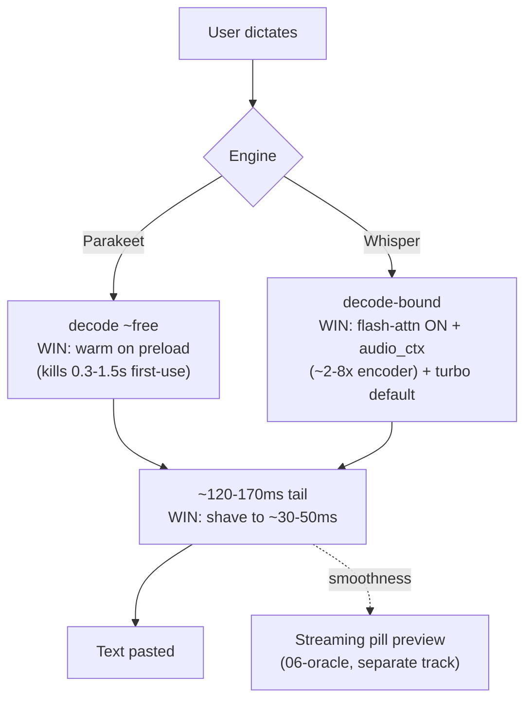

# Voicetypr performance master roadmap

> Synthesis of 6 source-grounded perf teardowns (`01`–`05`, `07`) against VT `main` @ `af63ab1`, the Handy teardown, and `06-oracle-decision.md`. Every number below traces to a slice doc with `path:line`. **Nothing is committed; this is the plan.**

---

## The headline (what actually moves the needle)

Two facts reframe the whole "make it fast" ask:

1. **The paste-plumbing tail is already ~mostly fixed.** Plan 028's ~950 ms stop→text tail has **already collapsed to ~120–170 ms** — ~780 ms was recovered by Phase 0 work that already shipped (non-blocking clipboard restore, CGEvent paste, in-process normalize-first). (`01-hotpath` re-baselined table.) So "kill the plumbing" is now a **~70–90 ms polish**, not the main event.
2. **The real remaining latency splits cleanly by engine:**
   - **Parakeet:** decode is ~free (~110–155× realtime on ANE). The user-visible cost is now (a) **first-dictation ANE warm-up** the app never pays down (~0.3–1.5 s, one-time per session) and (b) the ~120–170 ms tail. (`04-parakeet`, `07`.)
   - **Whisper:** **decode-bound**, and VT leaves **two free multipliers on the floor** — Metal **flash-attention is OFF** and **`audio_ctx` is never set** (every 2–8 s clip pays a full 30 s encoder window). (`03-whisper`, `07`.)

**So the fastest wins are NOT more paste-tuning.** They are: turn on Whisper's free speedups, warm Parakeet on preload, and only then chase the last ~70 ms of plumbing. Streaming (the Handy feel) is a *smoothness* layer on top, already designed in `06-oracle-decision.md`.

---

## Tier 1 — measurement-gated low-effort wins (do first; S effort, but WER/behavior-gated)

> **Corrected per pressure-test (`08`) + multilingual constraint:** these are "cheap + reachable without patching C," NOT "free + safe." Flash-attn and turbo change transcript output and degrade **most on non-English** — and **VT's user base is multilingual (English + European)**. Because auto-detect means **the language is unknown until *after* decode**, turbo/flash-attn **cannot be gated by detected language on the first pass** → they become an **explicit user "speed mode" opt-in**, not a silent default. `audio_ctx` (T1.1) is **language-independent** and stays the safe first win. **T1.0 (instrument + *multilingual* WER harness) gates T1.1/T1.3/T1.4.**

| # | Win | Where | Impact | Risk | Guard |
|---|---|---|---|---|---|
| **T1.0** | **Instrument first: stop→text + decode + load + warm spans (p50/p95) + a MULTILINGUAL WER/last-word corpus** (English + fr/de/es/it/pt/nl + a Slavic/Nordic sample) | new; keyed to existing `log_performance`/`WHISPER_INFERENCE` spans | makes every claim provable; gates regressions per-language | — | corpus MUST be multilingual, not English-only — the whole turbo/flash-attn decision hinges on non-English WER |
| **T1.1** | **Length-adaptive `audio_ctx`** for short clips | `whisper/transcriber.rs` params (never set today) | **~2–8× encoder speedup** on common 2–8 s dictation — biggest recurring Whisper win | Med | multiple of 64; **floor ~256 (~5 s), not 64**; +0.5–1.0 s tail pad + 15–25% margin; **last-word assertion** + WER sweep (plan 015); change *alone*, not bundled with `no_context`/`single_segment` |
| **T1.2** | **Warm Parakeet: eager-resident preload + warm prediction** (spawn sidecar + load model + 1 tiny discarded decode) | `04-parakeet`: `lib.rs:1886`, `settings.rs:765` (today weights-only, no warm predict) | **kills ~0.3–1.5 s first-dictation ANE compile** — *only if* spawn+load already done | Low | split spans `sidecar.spawn_ms`/`model.load_ms`/`first_prediction_ms`/`warmup_ms`; warm decode alone ≠ fix if first cmd lazily spawns |
| **T1.3** | **Flash-attn as an explicit "speed mode", NOT auto-on** — `ctx_params.flash_attn(true)` | `whisper/transcriber.rs:57` | faster Metal decode + less GPU mem, every call. 1 line, reachable | **Med-High (multilingual)** | **transcript NON-identical** (whisper.cpp #3020: turbo non-English regressions); DTW-incompatible; **can't scope-to-English — language unknown until after decode (auto-detect)** → default OFF, expose as user opt-in; validate on the multilingual corpus |
| **T1.4** | **`large-v3-turbo` as explicit "speed mode", NOT the silent multilingual default** | `whisper/manager.rs:129,148` (both `accuracy=9` today = UX bug) | ~4–7× faster, **but ~2.5 WER pts worse multilingual** (not +0.3-0.7), worse on non-English, **cannot translate** | **Med (multilingual)** | **keep large-v3 the default for multilingual/auto users**; turbo = opt-in speed mode; **on macOS steer European users to Parakeet v3 (multilingual, ANE-fast, no turbo tradeoff)**; keep override |
| **T1.5** | **Stop-thread join poll 100 ms → 5 ms** | `audio/recorder.rs:782` | ~45 ms avg slack removed, recurring | Low | failure cap unchanged; pure wakeup latency (genuinely near-free) |
| **T1.6** | **Close level-meter plan-008 allocation** — unbounded `mpsc::send` on RT thread | `audio/level_meter.rs:47` | removes ~10 heap allocs/s on audio hot path (correctness guardrail, **not** latency) | Low | bounded `sync_channel`+`try_send` or atomic |
| **T1.7** | **Guard `log_with_context` alloc + trim release hot-path Info logs** | `utils/logger.rs:262-270` (allocates+formats *before* level check), `lib.rs:315-326` | true near-free hygiene; removes alloc churn around decode/start/stop | Low | add `if !log::log_enabled!(level) { return; }`; keep errors + coarse spans |
| **T1.8** | **Pill micro-bundle + drop Radix metapackage** | `05-cloud-and-shell` (pill 118 KB + globals 190 KB = 308 KB JS for a 3-dot overlay; toast=1.1 KB) | → ~10–15 KB; faster overlay spawn; "feels lightweight" more than last 10 ms of paste tail | Low | display-only; promoted from Tier 3 per critique |
| **T1.9** | **Adaptive Soniox REST poll** (250 ms early → back off) *(P1 if Soniox is material; else P2)* | `cloud_stt/soniox.rs:196,390` | recovers ~400–600 ms p50 as cheap interim before WS | Low | keep REST fallback; WS is the Tier-2 real fix |

**Tier 1 net:** Whisper users get a multiplicative decode speedup (audio_ctx × turbo × flash-attn) *after the corpus gate*; Parakeet first-dictation de-lagged up to ~1.5 s; app *feels* lighter (bundle) and the RT callback stops allocating. **All gated by T1.0 — ship the harness first.**

---

## Tier 2 — the last of the plumbing tail + cloud (S/M effort)

| # | Win | Where | Impact | Risk |
|---|---|---|---|---|
| **T2.1** | Remove one redundant clipboard settle (two 15 ms sleeps fire) | `text.rs:342` + `:656` | 15 ms | Med — cross-app paste QA |
| **T2.2** | Cut/overlap the 20 ms pill-hide sleep | `audio.rs:5561` | 0–20 ms | Med — needs verified non-activating overlay (see risk below) |
| **T2.3** | Reduce `paste_mac` inter-event sleep 15→0-5 ms | `text.rs:671` | ~10 ms | Med — bare-`v` regression counter |
| **T2.4** | Overlap Parakeet model-load with normalize tail | `executor.rs:212` | ~10–40 ms (cold-ish) | Med — engine-lease/cancel ordering |
| **T2.5** | **Soniox REST poll → WebSocket** (removes 1000 ms poll floor) | `cloud_stt/soniox.rs:196,390` | +500 ms mean / +1000 ms p95 removed → 249 ms median | Med — auth/reconnect; keep REST fallback |
| **T2.6** | **`lto="thin"` + `codegen-units=1`** release profile *(moved from Tier 1 per critique — it's a release-gate, not an app-latency knob)* | `src-tauri/Cargo.toml:126-133` | ~5–15% smaller binary + inlining (near-zero on Metal, more on CPU/Windows) | Low-Med | keep `strip="none"`+line-tables + `panic=unwind`; **release ships only after a forced-panic crash resolves native fn+file:line in Sentry/Bugsink on macOS AND Windows** |
| **T2.7** | **Collapse WAV write→read round-trip → in-memory PCM handoff** *(moved up from Tier 3 — it's quality + the streaming seam, not just footprint)* | `02-audio-pipeline` O2 | ~4–10 ms/record (more on slow FS) + removes lossy f32→i16→f32 dither churn | Med — never-lose-speech (keep raw WAV artifact) |

**Tier 2 net:** stop→text fixed tail drops from ~120–170 ms toward **~30–50 ms**; cloud (Soniox) first-text drops ~500 ms–1 s; smaller binary; cleaner audio seam.

---

## Tier 3 — footprint & idle (M effort; matters for "lightweight")

| # | Win | Where | Impact |
|---|---|---|---|
| **T3.1** | Lazy-load settings/history WebViews | shell | ~50–150 ms each deferred off startup |
| **T3.2** | Idle CPU: DeviceWatcher CoreAudio enum (0.67 Hz) + RecorderWatchdog (250 ms probe) backoff | shell | trim idle wakeups (trigger engine itself is event-driven ~0% — good); keep hotplug SLA |
| **T3.3** | In-process decode on **import** paths (symphonia/AVFoundation-first → ffmpeg fallback) | `02-audio-pipeline` §3 | ~50–150 ms/import spawn avoided; **0 on live mic** |

---

## Tier 2.5 — cross-cutting perf (surfaced by pressure-test `08`; measure-then-decide)

> These the 6 slices under-covered. None are "just flip it" — each needs a benchmark behind a branch/profile before shipping.

| # | Win | Expected impact | Owner |
|---|---|---|---|
| **X1** | **Metal warm-up** (tiny discarded decode after Whisper preload) — separate from Parakeet ANE warm | first Whisper dictation −tens–hundreds ms (one-time); WER unaffected (result discarded) | whisper |
| **X2** | **Whisper/Parakeet model mmap vs full-load** — instrument load separately from first inference | first-use −hundreds ms and/or RSS reduction (1–3 GB resident today); measure before changing | whisper+parakeet+shell |
| **X3** | **Tokio blocking-pool / dedicated STT executor** — `features=["full"]`, no worker/blocking sizing today | prevents p95 tail spikes when normalize+decode+clipboard+startup contend | backend |
| **X4** | **Global allocator experiment** (mimalloc/jemalloc behind a profile) | smoother p95 in decode/log/JSON paths — or neutral/worse on macOS; measure, don't adopt on faith | shell |
| **X5** | **`n_threads` tuning** (currently `parallelism-1`, includes E-cores on Apple Silicon) | ±5–15% + thermal; auto-tune per model/clip, don't hard-code | whisper |
| **X6** | **Sentry/telemetry hot-path guardrail** — no breadcrumbs/events on audio callback, level events, or per-partial streaming | prevents a future latency regression; panic-capture only | shell/telemetry |

---

## The ffmpeg decision (your interjection, resolved)

**ffmpeg stays — it is the multi-format decoder for local models, not a resampler.** The win is stopping the *spawn* on common paths, never removal:

- **Live mic** (all OS): already in-process (CPAL PCM → rubato). ✓
- **Import → Whisper (Rust):** symphonia-first (covers mp3/AAC-LC/ALAC/FLAC/Vorbis/WAV/AIFF/CAF/MP4), **ffmpeg fallback** for its gaps.
- **Import → Parakeet (macOS):** route through the sidecar's **AVFoundation converter already present** (`main.swift:597`) — ffmpeg-free for the OS-native set, **ffmpeg fallback** for the rest.
- **ffmpeg's residual, essential role:** **Ogg/Opus (WhatsApp/Telegram voice notes), WMA, HE-AAC, exotic** — symphonia 0.5.4 (per `Cargo.lock`) has no `codec-opus`/WMA/HE-AAC, and AVFoundation doesn't decode Ogg-Opus. **Never blanket-remove.**

Optional later: add an `opus` crate so the Whisper path also drops ffmpeg for Opus — bring the measured frequency first.

---

## What is NOT here (correctly scoped out)

- **Streaming architecture** (committed/tentative, StreamRouter, decode-ahead, EOU) — a *smoothness* track, fully designed in `06-oracle-decision.md`. Its perf properties are cited here as levers (T-future), not redesigned. `07` ranks Whisper decode-ahead (#7) and Parakeet EOU (#8) as the L-effort smoothness plays after Tier 1–2.
- **faster-whisper/CT2 int8** — CUDA-specific, does **not** transfer to VT's Metal/CPU. Don't chase it. (`07`.)

---

## Recommended sequence (the "do this in this order")

1. **T1.0 — instrument + build the WER/last-word corpus harness FIRST.** Stop→text + decode + model-load + warm spans (p50/p95) on Parakeet & Whisper at 2/5/15 s. This is a hard gate: every WER-affecting win (audio_ctx, flash-attn, turbo) ships *through* it.
2. **Genuinely-free wins immediately** (no WER risk): join-poll 100→5 ms (T1.5), level-meter alloc (T1.6), log-alloc guard (T1.7), pill micro-bundle (T1.8).
3. **WER-gated Whisper wins through the *multilingual* harness**, one at a time: audio_ctx (T1.1, language-independent → the safe global win) → then turbo & flash-attn as **explicit opt-in "speed mode"** (NOT silent defaults — they degrade non-English and can't be scoped by language on auto-detect).
4. **Parakeet eager preload + warm** (T1.2) — and on **macOS, make Parakeet v3 the recommended path for European users** (multilingual, ANE-fast, no turbo tradeoff); **adaptive Soniox poll** (T1.9) if cloud is material.
5. **Tier 2** plumbing polish (focus/paste QA-gated) + Soniox WS + LTO (release-smoke-gated) + WAV-roundtrip collapse.
6. **Tier 2.5** cross-cutting (Metal warm, mmap, tokio pool, allocator, n_threads) — measure-then-decide.
7. **Tier 3** footprint/idle.
8. **Then** the streaming smoothness track (`06-oracle`) for the Handy live-preview feel.

## The single "do first"
**Build the fixed latency + WER/last-word harness (T1.0), then use it immediately to ship the conservative `audio_ctx` rollout (T1.1).** That converts the largest recurring Whisper win from risky theory into a measured default (hundreds of ms on common short clips), and the *same* harness then gates flash-attn, turbo, Parakeet warm, and every paste-tail cut — so nothing ships blind against the never-lose-speech / WER guardrails. (Ship the three no-WER-risk wins — join-poll, level-meter alloc, log-alloc — alongside it since they need no gate.)

---

## Correctness guardrails (apply to every change)
- **plan 008**: never allocate/lock/block in the CPAL callback (T1.7 fixes the one violation found).
- **plan 015**: never-lose-speech — audio_ctx trimming must be length-gated with a floor; decode-ahead deferred to the streaming track.
- **Symbolication is a product constraint**: LTO is *likely* symbol-safe but **MUST be verified with a release-build crash smoke** (Sentry resolves native names; dSYM/PDB intact) before shipping — do not assume.
- **Paste reliability & focus**: every sleep removal (T2.1–T2.3) needs the cross-app QA matrix + a verified non-activating overlay (currently *unverified* per `06` trap 7 — resolve before T2.2).
- **WER bar (MULTILINGUAL)**: the acceptance corpus MUST span English + European languages (fr/de/es/it/pt/nl + a Slavic/Nordic sample) — VT's user base. flash-attn, audio_ctx, greedy-vs-beam, and turbo each need a **per-language** WER delta check. Because auto-detect hides the language until after decode, turbo & flash-attn ship as **explicit user speed-mode opt-ins**, never silent multilingual defaults. audio_ctx is language-independent (duration-based) and can default globally once the last-word assertion passes.
- **Parakeet is ASR-only (no translation)**: steering macOS European users to Parakeet v3 is correct for *native-language transcription*, but any user who needs **translate-to-English MUST stay on Whisper large-v3** (turbo can't translate either; VT already parses `translate_to_english` but can't forward it to Parakeet). Surface this in the model-pick UI, don't silently drop the translate intent.

## Source docs
`01-hotpath-latency.md` · `02-audio-pipeline.md` · `03-whisper-engine.md` · `04-parakeet-engine.md` · `05-cloud-and-shell.md` · `07-competitive-sota.md` · streaming: `../handy-teardown/06-oracle-decision.md`
