# Hotkey→text critical path — VoiceTypr perf teardown

> Scope: the **local success path** on macOS (Parakeet + Whisper), hotkey-accept → text-at-cursor.
> Source: VoiceTypr `main`, HEAD `af63ab1` (CLEAN). All citations are `path:line` relative to repo root.
> Cross-refs: plan `plans/028-transcription-latency-streaming.md` (Evidence A latency table), `06-oracle-decision.md` (settled streaming decision — streaming redesign is OUT of scope here; this doc is the perf/squeeze layer).

## TL;DR

**Plan 028's ~950 ms fixed post-decode tail has already mostly landed as Phase 0.** Live `main` no longer spawns ffmpeg on the happy path (in-process `normalize_to_whisper_wav` first, `audio.rs:4929-4934`), no longer blocks `insert_text` on the 500 ms clipboard restore (it's a background, generation+content-guarded thread, `text.rs:276-325`), killed the 50 ms `insert_text` pre-delay, replaced rdev's 300 ms paste with a ~30 ms CGEvent ⌘V (`text.rs:645-680`), and trimmed the clipboard settle 50→15 ms. **The remaining blocking sleeps on the text-visible path total ≈ 65 ms** (20 ms pill-hide + 15+15+15 ms clipboard/paste). The restore's 500 ms is now off the critical path entirely. The highest-ROI remaining wins are (1) the **coarse 100 ms poll on the stop-thread join** (`recorder.rs:782`, est. ~45 ms avg wasted), (2) a **redundant duplicate clipboard settle** (two 15 ms settles fire back-to-back, `text.rs:342` + `:656`), and (3) the residual **20 ms pill-hide sleep** (`audio.rs:5561`) plus the **15 ms inter-CGEvent sleep** (`text.rs:671`). For **Parakeet this ~65 ms + stop-drain is most of the perceived latency** (decode is ~tens of ms); for **Whisper decode dominates** and these plumbing wins are a smaller fraction — the decode levers (turbo, `set_audio_ctx`, decode-ahead) live in `07`/streaming work, not here.

---

## Current-state map (how the path works today)

```mermaid
flowchart LR
  HK["hotkey<br/>recording/hotkeys.rs"] --> START["start_recording<br/>audio.rs:3733"]
  START --> SND["play start sound<br/>concurrent w/ init"]
  START --> DEV["device enum + CPAL build<br/>recorder.rs:274-339"]
  DEV --> REC["Recording"]
  REC -->|"hotkey stop"| STOP["stop_recording<br/>audio.rs:4406"]
  STOP --> DRAIN["callback drain barrier<br/>recorder.rs:632-648<br/>≤200ms, 5ms poll"]
  DRAIN --> JOIN["stop-thread join<br/>recorder.rs:774-783<br/>100ms poll!"]
  JOIN --> NORM["in-process normalize<br/>audio.rs:4929<br/>rubato+peak+dither"]
  NORM --> GATE["duration gate ≥0.5s<br/>audio.rs:4984-5006"]
  GATE --> SPAWN["tokio::spawn task<br/>audio.rs:5095"]
  SPAWN --> EXEC["transcribe_with_app<br/>executor.rs:50"]
  EXEC --> DECODE["engine decode<br/>Parakeet ~tens ms / Whisper var"]
  DECODE --> HIDE["hide pill<br/>audio.rs:5550"]
  HIDE --> SLP1["sleep 20ms<br/>audio.rs:5561"]
  SLP1 --> INS["insert_text<br/>text.rs:92"]
  INS --> SET["set_text + sleep 15ms<br/>text.rs:336-342"]
  SET --> PASTE["paste_mac CGEvent<br/>15+15ms<br/>text.rs:656,671"]
  PASTE --> RESTORE["bg restore 500ms<br/>text.rs:280 NON-blocking"]
```



### A. Hotkey accept → start (`recording/hotkeys.rs`)

Toggle mode has a **300 ms throttle** that drops only *duplicate* presses while the key is held / pressed too fast — it does NOT delay the first press:
```rust
// recording/hotkeys.rs:37-44
if let Some(last) = *last_press {
    if now.duration_since(last).as_millis() < 300 {
        log::debug!("Toggle: Throttling hotkey press (too fast)");
        true   // throttled → pill_toast("Hold on...")
```
Plus a `claim_toggle_press` CAS on `toggle_key_held` (`:28,98-100`) so auto-repeat while held is rejected. First-press latency = 0 ms.

### B. `start_recording` (`commands/audio.rs:3733`)

Validates requirements (`:3770`, license/readiness — can be the slow cold leg on first record), an idempotent fast-path that no-ops a redundant start before any side effect (`:3812-3824`), bumps `RECORDING_GENERATION` and clears stale flags **before** publishing `Starting` (`:3838-3844`), then plays the start sound **concurrently** with device init — the plan-015 300 ms sleep is **gone**:
```rust
// audio.rs:3863-3868
if play_sound {
    play_recording_start_sound();
    // Capture first: play the chime concurrently with microphone/device initialization
}
```
Device enumeration in `recorder.rs:276-297` is now a **single** enumeration (find-by-name OR default — not both). Plan 028's "duplicate device enumeration at recorder.rs:145-155,185-191" is stale: those line ranges no longer exist; the current code does one `host.input_devices()` OR one `host.default_input_device()`.

### C. Stop → final WAV (`audio/recorder.rs`)

`stop_recording` (`:743`) sends `Stop`, then spins a **drain barrier** waiting for the CPAL callback to acknowledge (one final write), bounded to 200 ms with a 5 ms poll:
```rust
// recorder.rs:633-644
stop_requested.store(true, Ordering::SeqCst);
let drain_start = Instant::now();
while !callback_drained.load(Ordering::SeqCst) {
    if drain_start.elapsed() > Duration::from_millis(200) { ... break; }
    std::thread::sleep(Duration::from_millis(5));
}
```
The WAV writer is finalized non-blockingly (`try_send(Finalize)` + `drop(writer_tx)`, `:693-695`) and joined with a 10 ms-poll bounded join (`join_writer_bounded`, `:871-890`; "drains its bounded queue in microseconds" per the block-write fast path). The **outer stop-thread join polls at 100 ms**:
```rust
// recorder.rs:774-783
while start.elapsed() < timeout {        // STOP_JOIN_TIMEOUT = 8s failure cap
    if thread_handle.is_finished() { ... return ... }
    std::thread::sleep(Duration::from_millis(100));   // ← coarse
}
```
The RT callback is allocation-/blocking-/drop-free by design (recycled chunk pool, `try_send`, `catch_unwind`, `recorder.rs:473-548`) — plan 008 invariants intact.

### D. Normalize + duration gate (`audio.rs:4918-5026`)

For local engines the desktop normalizes **in-process first**, ffmpeg only as fallback — a Phase-0 win that landed:
```rust
// audio.rs:4926-4934
let in_proc = tokio::task::spawn_blocking(move || {
    crate::audio::normalizer::normalize_to_whisper_wav(&a, &d)
}).await;
match in_proc {
    Ok(Ok(path)) => path,                 // happy path: NO ffmpeg spawn
    other => { ... crate::ffmpeg::normalize_streaming(&app, &audio_path, &out_path).await ... }
}
```
`normalize_to_whisper_wav` (`audio/normalizer.rs:20-119`) reads the WAV, downmixes, resamples via rubato `Fft` to 16 kHz (`:67-71`), peak-normalizes with a speech-gated gain cap (`:76-86`), TPDF-dithers, and writes a fresh WAV. Pure CPU + file I/O, **no process spawn** on the happy path. The duration gate then runs **on the normalized file**:
```rust
// audio.rs:4984-5006  (gate reads normalized_path, 0.5s for both PTT & Toggle, :4979-4981)
let reader = hound::WavReader::open(&normalized_path) ...
let duration = frames as f32 / spec.sample_rate as f32;
Ok((duration < min_duration_s_f32, duration_ms))
```
Note the **sequencing**: normalize runs *before* the gate, so even a sub-0.5 s clip pays the full normalize cost before being rejected.

### E. Decode (executor — variable cost)

`transcribe_with_app` → `run_with_policy` → `route_once` (`executor.rs:50,305,176`). It re-checks normalization once via `prepare_normalized_input` (`:418-433`), which **short-circuits** because the desktop already produced a 16 kHz mono WAV:
```rust
// executor.rs:425-427
if is_normalized_wav(input_path) {
    return Ok(PreparedInput::AlreadyNormalized(input_path.to_path_buf()));
}
```
So no double-normalize on the desktop path — just one extra WAV-header open (~sub-ms). Parakeet loads its CoreML model + batch `transcribe` (`:208-272`); Whisper runs `transcribe_whisper_with_acceleration` (`:188-207`) under a cooperative watchdog that sets the cancel flag on deadline but **never aborts the blocking decode** (`executor.rs:344-398`). `set_audio_ctx` is not set (full context) per plan 028.

### F. Delivery → insert (`audio.rs:5269-5719`, `text.rs`)

The transcription result flows through VT's generation-gated side-effect chokepoint. `persist_if_current` (`audio.rs:143-153`) snapshots cancel/generation and runs the synchronous commit with no `.await` between; `delivery_aborted` (`:162-164`) is re-checked at every checkpoint (Race 1/2/3 at `:5240,:5256,:5526,:5581,:5671`). On the no-AI success path, `writing::process_transcription` is deterministic (~ms); the AI-polish network hop only fires when `ai_enabled` + an AI-requiring preset (`:5348-5363`).

After decode, the path is:
1. **Hide pill** (`audio.rs:5550-5558`, `should_hide_pill` + `hide_pill_window`).
2. **20 ms sleep** "focus stability after pill hide (was 50ms)" (`audio.rs:5561`).
3. Read `auto_paste` setting (`:5571-5577`).
4. `insert_text` (`text.rs:92`) → `spawn_blocking` → `insert_via_clipboard` (`:354`).
5. `run_clipboard_insertion` (`:330`): `set_text` then **`sleep(CLIPBOARD_SETTLE_DELAY=15ms)`** (`:342`).
6. `paste()` → `try_paste_with_rdev` (pre-paste 0 ms on macOS, `:190,:602`) → **`paste_mac`** (`:645`): CGEvent ⌘V with **15 ms settle** (`:656`) + key-down post + **15 ms inter-event sleep** (`:671`) + key-up post.
7. On `Pasted`, schedule `spawn_deferred_clipboard_restore` (`:476`) → background thread **`sleep(500ms)`** then content+generation-guarded restore (`:276-325`). **This 500 ms no longer blocks the `insert_text` return** — text is already visible at step 6.

---

## Re-baselined latency budget (hotkey → text, macOS local success path)

Verdict vs plan 028 Evidence A (rows 1–13). `STILL-PRESENT` = unchanged mechanism; `PARTIAL` = landed but trimmed/remaining; `GONE` = removed from this path.

| 028# | Step | Live citation | Current cost | 028 cost | Verdict |
|---|---|---|---|---|---|
| 1 | Hotkey accept (toggle/PTT) | `recording/hotkeys.rs:37-44,98-100` | 0 ms first press (300 ms throttle drops *duplicates* only) | 0 ms | **STILL-PRESENT** (benign) |
| 2 | `start_recording` validate/config | `audio.rs:3770` (`validate_recording_requirements`), `:3812-3844` | ~ms warm; license check can be the cold leg | 0 ms | **STILL-PRESENT** |
| 3 | Start sound | `audio.rs:3863-3868` (concurrent, no sleep) | **0 ms** | 0 ms (028 said 300 ms sleep gone) | **GONE** ✓ |
| 4 | Device/recorder init (CPAL build, `stream.play`) | `recorder.rs:276-339` | device-bound; **single** enumeration (dup removed) | device-bound + dup enum | **PARTIAL** (dup GONE) |
| 5 | Stop → final WAV (drain + writer finalize) | `recorder.rs:632-648` (drain ≤200ms/5ms poll), `:693-695` (non-blocking finalize), `:871-890` (writer join 10ms poll), `:774-783` (**stop-thread join 100ms poll**) | ~0 drain + µs finalize typically; **up to ~100ms slack** on outer join poll (avg ~50ms waste) | 0–200ms + 100ms poll | **PARTIAL** (writer fixed; **100ms outer poll STILL-PRESENT**) |
| 6 | Normalize to 16 kHz mono | `audio.rs:4929-4934` (in-process first) → `normalizer.rs:20-119`; ffmpeg fallback `audio.rs:4947-4959` | in-process CPU+IO, **no spawn** happy path; NEEDS-MEASUREMENT (est. 5–30 ms short clip) | ffmpeg spawn every rec | **PARTIAL** (ffmpeg GONE on happy path) ✓ |
| 7 | Min-duration gate | `audio.rs:4979-4981,4984-5006` | 0.5 s gate (PTT & Toggle); runs **after** normalize | 0.5 s gate | **STILL-PRESENT** (now post-normalize) |
| 8 | Engine decode | Parakeet `executor.rs:208-272`; Whisper `:188-207` | Parakeet ~tens ms; Whisper variable (decode-bound) | variable | **STILL-PRESENT** (out of fixed-tail scope) |
| 9 | Pre-insert UI-stabilize sleep | `audio.rs:5561` | **20 ms** ("was 50ms") | 50 ms | **PARTIAL** (50→20) |
| 10 | `insert_text` pre-delay | `text.rs:92-138` (no sleep) | **0 ms** | 50 ms | **GONE** ✓ |
| 11 | Clipboard set + settle | `text.rs:182` (15ms macos), `:336-342` (set_text + sleep) | **15 ms** | 50 ms | **PARTIAL** (50→15) |
| 12 | macOS paste | `text.rs:645-680` (`paste_mac` CGEvent), `:190` (pre-paste 0ms) | **~30 ms** (15 settle `:656` + 15 inter-event `:671`) + 2× CGEvent post | 300 ms (rdev 50+50+4×50) | **PARTIAL** (300→~30) ✓ |
| 13 | Clipboard restore | `text.rs:276-325` (background thread), `:178` (500ms), `:476` (spawn) | 500 ms **non-blocking** (off critical path) | 500 ms blocking | **GONE** (from critical path) ✓ |

**Re-baselined fixed plumbing tail (text-visible-blocking), macOS local success path:**
- **stop→decode-start:** drain(~0) + stop-join-poll-slack (avg ~50 ms, NEEDS-MEASUREMENT) + normalize (5–30 ms, NEEDS-MEASUREMENT) + gate/header reads (~ms) ≈ **55–85 ms** [NEEDS-MEASUREMENT]
- **decode-end→text-visible:** 20 ms pill-hide (`audio.rs:5561`) + 15 ms settle (`text.rs:342`) + 15 ms paste settle (`text.rs:656`) + 15 ms inter-event (`text.rs:671`) = **65 ms** blocking sleeps + ~10–20 ms non-sleep I/O (pill hide IPC, `set_text`, `get_text` verify, store reads, `spawn_blocking`)
- **≈ 120–170 ms fixed**, vs 028's ~950 ms. **~780 ms already recovered by landed Phase 0.**

**Parakeet** total stop→text ≈ fixed (~120–170 ms) + decode (~tens ms) ≈ **~150–220 ms**. Latency is ≈ plumbing, confirming `06-oracle-decision` Q5.
**Whisper** total ≈ fixed + decode (hundreds of ms–seconds). Decode-bound; plumbing is a smaller fraction.

---

## Opportunities table

Sorted by impact-per-effort. Impact = ms saved on the text-visible path unless noted.

| # | Opportunity | Mechanism (concrete) | Est. impact | Effort | Risk | Invariant touched |
|---|---|---|---|---|---|---|
| 1 | Tighten stop-thread join poll 100→5 ms | `recorder.rs:782` `thread::sleep(100ms)` → `5ms` (match the 5/10 ms polls already used for drain/writer) | ~45 ms avg wasted slack removed (NEEDS-MEASUREMENT) | S | Low | None — pure wakeup latency; failure cap (8 s) unchanged |
| 2 | Remove redundant clipboard settle | `text.rs:342` (`run_clipboard_insertion` sleeps 15 ms) **and** `text.rs:656` (`paste_mac` sleeps 15 ms settle) both fire. Drop ONE (keep the one closest to the paste). | 15 ms | S | Med | no-clipboard-clobber / paste reliability — needs cross-app QA |
| 3 | Cut/overlap the 20 ms pill-hide sleep | `audio.rs:5561` `sleep(20ms)`. Either remove (verify focus retained) or overlap with the `auto_paste` store read that follows | 0–20 ms | S | Med | focus-steal — target app must retain key/focus before ⌘V |
| 4 | Reduce `paste_mac` inter-event sleep | `text.rs:671` `sleep(15ms)` between key-down and key-up. CGEvent flag-on-key is deterministic; probe 0–5 ms | up to ~10 ms | S | Med | paste reliability (bare-`v` regression if too tight) |
| 5 | Gate duration BEFORE normalize | `audio.rs:4984-5006` reads normalized file. Read **raw** WAV header duration first (`executor.rs:450-464` `wav_duration_ms` exists), skip normalize for <0.5 s clips | full normalize cost saved on rejected clips (NOT success path; improves reject-path feel) | S | Low | never-lose-speech — only shortens the *reject* branch; real speech still gated post-normalize |
| 6 | Collapse double WAV-header open | `audio.rs:4986` (gate opens normalized WAV) + `executor.rs:438` (`is_normalized_wav` opens it again). Pass the already-known spec/duration through the request | ~1–2 ms | S | Low | None |
| 7 | Pre-warm engine lease / overlap decode warmup | For Parakeet, begin model `load_model_with_cancel` (`executor.rs:212`) overlapped with the tail of normalize; today normalize→spawn→load is serial | ~10–40 ms (Parakeet cold-ish warm) NEEDS-MEASUREMENT | M | Med | engine-lease / single-model cache (`06` P1 trap 4); cancel must still win |
| 8 | Skip the in-process normalize when device already 16 kHz mono | Recorder captures at native rate (`recorder.rs:329-335`). Most macOS mics are 44.1/48 kHz so this rarely triggers, but a 16 kHz device or a future capture-at-16 kHz path skips resample+rewrite | 5–30 ms when applicable | M | Low | None (engine contract still met) |
| 9 | WAV write→read round-trip → memory bus | Recorder writes WAV to disk, normalizer reads it back, writes normalized WAV, decode reads it. 2 writes + 2 reads. OS-cache-hot for short clips (~ms), but real I/O for long clips | few ms short; grows with clip length | L | Med | This is the streaming-substrate boundary (`06`); out of scope for batch but note it |
| 10 | `yield_now` before decode | `audio.rs:5103` "give UI a moment to render loader". A scheduler yield (sub-ms), not a sleep; leave unless profiling shows contention | <1 ms | — | — | None |

---

## Deep-dive: top 5

### DD-1. Stop-thread join polls at 100 ms (`recorder.rs:782`)

**The change:** `audio.rs` stop calls `AudioRecorder::stop_recording` (`recorder.rs:743`), which sends `Stop` then busy-polls `thread_handle.is_finished()` sleeping **100 ms** between checks (`:782`), up to `STOP_JOIN_TIMEOUT = 8 s` (`:71`). The recording thread itself completes in ~drain(≤200 ms) + writer-finalize(µs). The inner sub-budgets already poll finer: drain at 5 ms (`:644`), writer join at 10 ms (`:883`). So the *outer* loop is the outlier.

**Why there's slack:** once the worker thread sets `is_finished()`, the outer loop won't notice for up to 100 ms (average ~50 ms of pure waiting after the work is already done). For Parakeet where total stop→text is ~150–220 ms, ~50 ms is a **20–30 % share of the whole tail**.

**The fix:** lower `recorder.rs:782` to `Duration::from_millis(5)` (or 10) to match the finer inner polls. No logic change; the 8 s failure cap is unchanged.

**Correctness guard:** none required — this only changes how quickly we *observe* completion, not the completion itself. The `Ok(Ok(msg))`/`Ok(Err(e))`/panic classification is identical. **NEEDS-MEASUREMENT**: instrument `drain_start.elapsed()` at thread completion vs `stop_recording` return.

### DD-2. Redundant duplicate clipboard settle (15 ms ×2)

**The change:** on macOS the path applies two settle delays back-to-back:
- `run_clipboard_insertion` (`text.rs:330-352`): `set_text` then `sleep(CLIPBOARD_SETTLE_DELAY = 15 ms)` (`:342`).
- then `paste()` → `try_paste_with_rdev` → `paste_mac` (`text.rs:645-680`): another `thread::sleep(15 ms)` settle (`:656`, "Settle delay (kept from the previous implementation)") before posting ⌘V.

The first settle (`:342`) was the original clipboard-settle after `set_text`; the second (`:656`) is a vestige of the pre-CGEvent rdev paste. With the deterministic flag-on-key CGEvent (`:658-669`), one settle is redundant.

**The fix:** keep exactly one settle immediately after `set_text` (the `run_clipboard_insertion` one at `:342` is the semantically correct place — "let the clipboard publish land before pasting"). Remove the `:656` settle inside `paste_mac`, OR collapse both into a single settle. Either way: **15 ms saved**.

**Correctness guard:** paste-reliability QA across apps (TextEdit/Notes/Chrome/VS Code/Slack/Google Docs) — must not regress to pasting the *previous* clipboard. Plan 028 STOP-condition: "if sleep removal causes paste to use the previous clipboard → restore that delay." The `get_text()` verify at `text.rs:344` already confirms the clipboard holds our text before paste.

### DD-3. The 20 ms pill-hide stability sleep (`audio.rs:5561`)

**The change:** after hiding the pill, the path sleeps 20 ms ("was 50ms") before reading `auto_paste` and calling `insert_text`. The pill hide (`:5550-5558`) is an async `hide_pill_window()`; the sleep exists so the target app re-acquires focus before ⌘V (a hidden overlay that momentarily took focus would otherwise steal the paste).

**Two options:**
1. **Overlap:** the `auto_paste` store read (`:5571`) is `await`-able and independent of focus — move it *before/parallel to* the pill hide so the 20 ms overlaps with store I/O instead of stacking on it.
2. **Reduce/remove:** if the pill is genuinely non-activating (NSPanel `focused(false)`, per `06` P1 trap 7), it never stole focus and the sleep may be 0-able. **Verify with focus-retain assertion**, then drop to 0–5 ms.

**Correctness guard:** focus steal is a release blocker (`06` P1 trap 7). Must assert the target window is key before ⌘V. If the overlay is ever focusable, keep a minimal settle. **NEEDS-MEASUREMENT**: log focus-state at paste time with/without the sleep.

### DD-4. `paste_mac` inter-event sleep (`text.rs:671`)

**The change:** `paste_mac` posts key-down ⌘V, sleeps 15 ms (`:671`), then posts key-up. The CGEvent carries the Command flag on the V event itself (`:664-669`), so it does not depend on the OS tracking a separately-posted synthetic Cmd — the 15 ms is conservative headroom from the rdev era.

**The fix:** probe reducing `:671` to 0–5 ms. The flag-on-key approach is the deterministic one (`:658-661` comment); the bare-`v` failure mode (dropped modifier) that motivated the old timing is structurally gone.

**Correctness guard:** the failure mode to watch is a bare `v` typed instead of ⌘V. QA across apps; if any app drops the modifier, restore to a value that holds. This is app/event-tap dependent — **NEEDS-MEASUREMENT** with a paste-success counter per app.

### DD-5. Normalize-before-gate sequencing (`audio.rs:4984`)

**The change:** the 0.5 s min-duration gate reads the **normalized** file (`:4986`). So a 0.3 s clip that will be rejected still pays the full in-process normalize (read + downmix + rubato resample + peak + dither + write) before being told "too short". The duration is knowable from the **raw** WAV header alone (`executor.rs:450-464` `wav_duration_ms` already exists).

**The fix:** read raw WAV duration first; if `< min_duration_s`, emit `recording-too-short` and skip normalize entirely. This is a **reject-path** win (not the success path), but it removes a chunk of wasted work + file I/O for accidental short taps, improving perceived responsiveness of the error branch.

**Correctness guard:** never-lose-speech (plan 015). The gate only rejects genuine <0.5 s captures; real speech ≥0.5 s still flows to normalize + decode unchanged. The header-only duration read is the same arithmetic the post-normalize gate uses, so the threshold is byte-identical. Low risk.

---

## Learn-from-others

(Cite `07-competitive-sota.md` once available; source-verified findings below.)

- **Handy's stop→insert is dominated by the same clipboard-paste contract, but it parallelizes aggressively.** Handy inserts once at stop with a non-activating NSPanel and never blocks on clipboard restore (per `00-README.md` §overlay). VT has now matched the *non-blocking restore* (DD/truth: `text.rs:276-325` is background + guarded) and the *deterministic CGEvent ⌘V*. The remaining gap is the **stacked settles/sleeps** Handy does not carry — VT still has 65 ms of them where Handy would have ~one settle.
- **whisper.cpp `examples/stream` & scribble** validate that decode can start *during* capture (decode-ahead), collapsing stop→decode to just the tail. That's the streaming substrate (`06`, out of scope here), but it's the structural answer to "what can move off the critical path": for Whisper, **all of decode** can begin pre-stop; for Parakeet batch is already fast enough that the plumbing *is* the latency.
- **The flag-on-key CGEvent technique** (`text.rs:658-669`) is the correct modern macOS paste idiom — it avoids the rdev "posted synthetic Cmd that the OS intermittently drops" class entirely. The residual 15 ms inter-event sleep is conservative headroom that faster tools (e.g. direct `CGEvent`-based launchers) do not pay; the floor is the HID event-tap dispatch latency (sub-ms).
- **cpal stop teardown**: the coarse outer poll is a known pattern smell. Libraries that care about stop latency (e.g. `beamify`-style audio hosts) use a `Condvar`/`Notify` wake on `is_finished` rather than polling. A `Condvar` signal from the worker thread at completion would make the slack **0 ms** deterministically — a clean M-effort follow-up to DD-1.

---

## Measurement plan

Instrument these spans/counters (additive, behind the existing `[REC TIMING]` debug logs at `audio.rs:3740` etc.), then capture p50/p95 on fixed 2 s / 5 s / 15 s clips for Parakeet **and** Whisper:

1. **`stop.thread_join_slack`** — `Instant` at worker `is_finished()` true vs `stop_recording` return. Proves DD-1. Target: <5 ms.
2. **`normalize.duration_ms`** + `normalize.fallback_used:bool` — around `audio.rs:4929-4962`. Proves row-6 PARTIAL and sizes DD-5. Confirm ffmpeg fallback ≈ 0 % on macOS mics.
3. **`paste.total_ms`** — already partially logged (`text.rs:631` "PASTE SUCCESS in {}ms"). Split into `set_text`, `settle`, `paste_mac`, `inter_event`, `post`. Proves DD-2/3/4 and rows 11/12.
4. **`delivery.pre_insert_sleep_ms`** — the 20 ms at `audio.rs:5561` plus any visible overlap. Proves DD-3.
5. **`restore.non_blocking_confirmed`** — assert `insert_text` returns before the 500 ms restore fires (timestamp both). Proves row-13 GONE.
6. **`focus.held_at_paste:bool`** — assert the target window is key at ⌘V post. Guards DD-3/4 removals.
7. **`gate.rejected_after_normalize_count`** — how often short clips pay normalize. Sizes DD-5 ROI.

Before/after metric for each P1: **stop→paste-event p50/p95** (the `paste_mac` CGEvent post timestamp) on the fixed clip set, Parakeet + Whisper, across the QA app matrix.

---

## Prioritized recommendations

**P1 — ordered stop→text wins (ms estimates, NEEDS-MEASUREMENT flagged):**
1. **DD-1: stop-thread join poll 100→5 ms** (`recorder.rs:782`). ~45 ms avg. Effort S, Risk Low. *No correctness guard; pure wakeup latency.* **Do first — biggest single win, zero risk.**
2. **DD-2: remove one redundant clipboard settle** (`text.rs:656` or `:342`). 15 ms. Effort S, Risk Med. *Guard: paste-reliability QA matrix; revert if previous-clipboard paste appears.*
3. **DD-3: cut/overlap 20 ms pill-hide sleep** (`audio.rs:5561`). 0–20 ms. Effort S, Risk Med. *Guard: focus-retain assertion at paste; keep minimal settle if overlay is ever focusable.* **NEEDS-MEASUREMENT** focus state.
4. **DD-4: reduce `paste_mac` inter-event sleep** (`text.rs:671`). up to ~10 ms. Effort S, Risk Med. *Guard: bare-`v` regression counter per app.* **NEEDS-MEASUREMENT.**

**P1 ceiling:** ≈ 70–90 ms more removable from the ~65 ms blocking-sleep tail + ~50 ms join slack → re-baselined tail could reach **~30–50 ms fixed** (Parakeet stop→text ≈ decode + ~30–50 ms).

**P2:**
5. DD-5: gate-before-normalize (reject-path feel, not success path). Effort S, Risk Low.
6. DD-6: collapse double WAV-header open. ~1–2 ms. Effort S, Risk Low.
7. DD-7: overlap Parakeet model load with normalize tail. ~10–40 ms. Effort M, Risk Med. **NEEDS-MEASUREMENT.**

**P3:**
8. DD-8: skip normalize for native-16 kHz devices. Effort M, Risk Low.
9. DD-9: WAV write→read round-trip → memory bus (streaming-substrate boundary; defer to `06`).
10. Replace stop-join poll with a `Condvar` wake (0 ms deterministic). Effort M, Risk Low.

---

## Open questions / risks

- **Is the overlay truly non-activating on every macOS version?** DD-3's safe removal depends on it. `06` P1 trap 7 says VT "appears partially aligned" but is *unverified*. **Resolve before removing the 20 ms sleep.**
- **Why does `paste_mac` keep *two* 15 ms sleeps (settle + inter-event)?** The `:655` comment "kept from the previous implementation" suggests neither was re-measured after the CGEvent migration. **NEEDS-MEASUREMENT** to know the true floor.
- **Stop-join slack actual value.** The 100 ms poll implies up to 100 ms / avg 50 ms, but if the worker nearly always finishes during the drain wait (not after), the realized slack may be smaller. **NEEDS-MEASUREMENT** (`stop.thread_join_slack`).
- **Normalize cost on the happy path** is unmeasured (5–30 ms estimate from rubato FFT resample of a short clip). If it's actually >30 ms for typical 5–10 s clips, DD-7 (overlap load) and DD-9 (memory bus) rise in priority.
- **Parakeet vs Whisper framing (per `06` Q5):** these P1 plumbing wins are "most of the stop→text speed for Parakeet"; for Whisper they're a small fraction of a decode-bound total. Don't message "plumbing makes Whisper fast" — pair this doc's P1 with the decode levers in `07`/streaming for Whisper users.
- All removals honor plan 015 never-lose-speech and the generation-gated delivery chokepoint (`audio.rs:62-164`) — none of the P1 items touch audio capture, the cancel/stale gates, or the restore's content+generation guard.
